# Fig. 2 模块化信息流重画说明

对象：Fig. 2 Online signal-flow diagram

结论：当前颜色确实意义不够明确。建议不要再用颜色简单区分“proc/comm/safe”这类节点类型，而是按 Fig. 1 的框架图逻辑，把 Fig. 2 画成“大模块容器 + 模块内部小模块 + 带数据名的箭头”。这样审稿人能看出系统架构，而不是只看到一串功能块。

## 推荐的大模块

建议设置 5 个大模块。颜色只用于区分大模块，箭头再用线型区分数据流、命令流、反馈流和保护流。

| 大模块 | 建议颜色 | 作用 | 是否放在 Fig. 2 |
|---|---:|---|---|
| M1 Offline learning layer | 浅蓝 | 离线数据、Koopman 模型训练、IRSP 稳定化、模型参数输出 | 可作为左上/上方输入模块 |
| M2 Upper-layer reference and communication layer | 浅青绿 | 4WS 参考路径生成、局部路径发布、上层到下层通信 | 必须放 |
| M3 Online prediction and consensus-MPC layer | 浅蓝灰 | 观测融合、lifting、Koopman 预测、链路质量共识、延迟补偿、MPC 求解 | 必须放，是核心 |
| M4 Safety, FDI/FTC, and certificate layer | 浅红 | 故障残差、FTC 重分配、证书检查、约束收紧、投影、降级 fallback | 必须放 |
| M5 Vehicle-payload environment and feedback layer | 浅紫/灰 | 车辆-载荷系统、执行、传感、误差/力/约束日志反馈 | 必须放 |

最建议的视觉布局：

```text
M1 Offline learning layer
       |
       | model package: Phi_theta, A, B, N_l, C, IRSP bounds
       v

M2 Upper-layer reference/communication ---> M3 Online prediction and MPC ---> M4 Safety/certificate ---> M5 Vehicle-payload system
             ^                                      ^                                  ^                         |
             |                                      |                                  |                         |
             +--------- reference/quality ----------+----------- feedback/logs --------+--------- sensor/log ----+
```

## M1 Offline learning layer

### 小模块

1. Offline data generation
2. Koopman lifting training
3. Bilinear Koopman regression
4. IRSP stability projection
5. Model package export

### 模块内部信息流

| 起点 | 终点 | 箭头标签 |
|---|---|---|
| Offline data generation | Koopman lifting training | training samples: state, input, curvature, delay/fault cases |
| Koopman lifting training | Bilinear Koopman regression | lifted state: `z = Phi_theta(chi)` |
| Bilinear Koopman regression | IRSP stability projection | bilinear operators: `A, B, N_l, C` |
| IRSP stability projection | Model package export | stabilized model and certificate bounds |

### 对外输出

| 起点 | 终点 | 箭头标签 |
|---|---|---|
| M1 Model package export | M3 Lifted-state prediction / MPC | `Phi_theta, A, B, N_l, C, IRSP bounds` |

这条箭头建议画成蓝色虚线或浅蓝实线，表示“离线模型输入到在线控制器”，不是实时闭环数据。

## M2 Upper-layer reference and communication layer

### 小模块

1. Global/reference path input
2. 4WS reference model
3. Local path packet generation
4. Reference communication
5. Link-quality measurement

### 模块内部信息流

| 起点 | 终点 | 箭头标签 |
|---|---|---|
| Global/reference path input | 4WS reference model | reference path: `r_ref, kappa_ref, v_ref` |
| 4WS reference model | Local path packet generation | 4WS geometry: `delta_f^up, delta_r^up, local headings` |
| Local path packet generation | Reference communication | temporary path packet: `P_{i,k}^{tmp}` |
| Link-quality measurement | Reference communication | link quality: `q_{ij,k}, delay, loss` |

### 对外输出

| 起点 | 终点 | 箭头标签 |
|---|---|---|
| Reference communication | M3 Delay compensation | delayed local path packet: `P_{i,k-d}^{tmp}` |
| Link-quality measurement | M3 Quality-aware consensus | communication state: `q_{ij,k}, tau_{ij,k}, loss_{ij,k}` |

这里不建议把 `4WS reference model` 直接连到 `Remote-state prediction`，中间应明确有 `local path packet` 和 `communication state`。

## M3 Online prediction and consensus-MPC layer

### 小模块

1. Observation fusion
2. Lifted-state construction
3. Delay compensation / remote-state prediction
4. Quality-aware consensus
5. Koopman prediction
6. MPC cost and constraints
7. Candidate control sequence

### 模块内部信息流

| 起点 | 终点 | 箭头标签 |
|---|---|---|
| Observation fusion | Lifted-state construction | fused observation: `chi_{i,k}` |
| Lifted-state construction | Koopman prediction | lifted state: `z_{i,k}=Phi_theta(chi_{i,k})` |
| Reference communication / delay input | Delay compensation | delayed reference/state packets: `P_{i,k-d}^{tmp}, x_{j,k-d}` |
| Delay compensation | Remote-state prediction | predicted neighbor state: `hat{x}_{j,k|k-d}` |
| Link-quality measurement | Quality-aware consensus | link weights: `w_{ij,k}=f(q, tau, loss)` |
| Quality-aware consensus | MPC cost and constraints | consensus target and tightening: `e_{ij,k}, rho_k, tightened bounds` |
| Koopman prediction | MPC cost and constraints | predicted trajectory: `hat{x}_{i,k:k+H}` |
| MPC cost and constraints | Candidate control sequence | candidate command: `u_{i,k:k+H}^*` |

### 对外输出

| 起点 | 终点 | 箭头标签 |
|---|---|---|
| Candidate control sequence | M4 FDI/FTC and certificate layer | candidate control: `u_i^*, predicted state, constraint margins` |

M3 是图的主体。箭头上必须写 `chi`, `z`, `hat{x}`, `w/q`, `tightened bounds`, `u_i^*` 这些数据名，否则读者看不出每一步传什么。

## M4 Safety, FDI/FTC, and certificate layer

### 小模块

1. FDI residual monitoring
2. FTC command reallocation
3. Lyapunov/ISS certificate check
4. Projection and constraint tightening
5. Degraded fallback
6. Safe command output

### 模块内部信息流

| 起点 | 终点 | 箭头标签 |
|---|---|---|
| Candidate control sequence | FDI residual monitoring | `u_i^*, y_i, hat{y}_i, residual r_i` |
| FDI residual monitoring | FTC command reallocation | fault flag and efficiency estimate: `f_i, eta_i` |
| FTC command reallocation | Lyapunov/ISS certificate check | repaired command: `tilde{u}_i`, predicted margin |
| Lyapunov/ISS certificate check | Safe command output | if pass: `u_i^{safe}=tilde{u}_i` |
| Lyapunov/ISS certificate check | Projection and constraint tightening | if fail: `certificate violation, margin < 0` |
| Projection and constraint tightening | Degraded fallback | contracted reference / tightened constraint: `r_ref^c, X^c, U^c` |
| Degraded fallback | Lyapunov/ISS certificate check | fallback candidate: `u_i^{fb}` |

### 关键纠正

`Errors, forces, constraints, logs` 不能指向 `Certificate passes?` 的 `no` 出口。正确逻辑是：

```text
Errors/forces/constraints/logs --feedback metrics: e_y, e_s, F, g(x,u), V--> Certificate check
```

它是下一次证书评估的输入或监控反馈，不是当前 `no` 分支。`no` 分支只能来自 `Certificate passes?` 这个菱形判断本身，指向 `Projection and constraint tightening`。

因此正确画法：

| 错误画法 | 正确画法 |
|---|---|
| logs 红色箭头接到 `no` 出口 | logs 灰色虚线接到 `Certificate check` 的输入侧 |
| `no` 像是由 logs 触发 | `no` 只从 certificate decision 输出 |
| 箭头无数据名 | 箭头标注 `feedback metrics: e, F, constraint margins, V` |

## M5 Vehicle-payload environment and feedback layer

### 小模块

1. Command publication
2. Command communication
3. Vehicle-payload system
4. Sensor/observer output
5. Error, force, constraint, and log computation

### 模块内部信息流

| 起点 | 终点 | 箭头标签 |
|---|---|---|
| Safe command output | Command publication | safe command: `u_i^{safe}` |
| Command publication | Command communication | command packet: `cmd_{i,k}` |
| Command communication | Vehicle-payload system | received command: `u_{i,k}^{recv}` |
| Vehicle-payload system | Sensor/observer output | measured state: `x_{i,k+1}, y_{i,k+1}` |
| Vehicle-payload system | Error/force/constraint logs | measured response: `x, payload pose, connection geometry` |
| Error/force/constraint logs | Observation fusion | feedback observation: `x_{i,k+1}, e_y, e_s` |
| Error/force/constraint logs | Certificate check | certificate feedback: `V, margin, g(x,u), force proxy` |

这部分建议用灰色或紫灰大模块，反馈箭头用灰色虚线，执行命令箭头用黑色或深蓝实线。

## 跨模块箭头总表

| 起点模块 | 终点模块 | 箭头标签 | 线型建议 |
|---|---|---|---|
| M1 Offline learning | M3 Online prediction/MPC | `Phi_theta, A, B, N_l, C, IRSP bounds` | 蓝色虚线 |
| M2 Reference/communication | M3 Online prediction/MPC | `P_{i,k-d}^{tmp}, r_ref, q_{ij,k}, tau_{ij,k}, loss` | 青绿色实线 |
| M3 Online prediction/MPC | M4 Safety/certificate | `u_i^*, predicted trajectory, constraint margins` | 深蓝实线 |
| M4 Safety/certificate | M5 Environment/execution | `u_i^{safe}, cmd_{i,k}` | 黑色/深蓝实线 |
| M5 Environment/feedback | M3 Observation fusion | `x_{i,k+1}, y_i, e_y, e_s` | 灰色虚线 |
| M5 Environment/feedback | M4 Certificate check | `V, margin, force proxy, g(x,u)` | 灰色虚线 |
| M4 Projection/fallback | M3 MPC constraints | `tightened bounds, contracted reference` | 红色虚线或红色实线 |

## 建议的最终图结构

下面这个结构可以作为重画 Visio 的直接蓝本：

```mermaid
flowchart LR
  subgraph M1["M1 Offline learning layer"]
    D1["Offline data generation"]
    D2["Koopman lifting training"]
    D3["Bilinear Koopman regression"]
    D4["IRSP stability projection"]
    D1 -->|"state-input samples"| D2
    D2 -->|"z = Phi_theta(chi)"| D3
    D3 -->|"A, B, N_l, C"| D4
  end

  subgraph M2["M2 Upper-layer reference and communication"]
    R1["Reference path"]
    R2["4WS reference model"]
    R3["Local path packet"]
    R4["Reference communication"]
    R5["Link-quality measurement"]
    R1 -->|"r_ref, kappa_ref, v_ref"| R2
    R2 -->|"delta_f^up, delta_r^up, headings"| R3
    R3 -->|"P_i,k^tmp"| R4
    R5 -->|"q, delay, loss"| R4
  end

  subgraph M3["M3 Online prediction and consensus-MPC"]
    C1["Observation fusion"]
    C2["Lifted-state construction"]
    C3["Delay compensation"]
    C4["Remote-state prediction"]
    C5["Quality-aware consensus"]
    C6["Koopman prediction"]
    C7["MPC cost and constraints"]
    C8["Candidate control sequence"]
    C1 -->|"chi_i,k"| C2
    C2 -->|"z_i,k"| C6
    C3 -->|"xhat_j,k"| C4
    C4 -->|"neighbor prediction"| C7
    C5 -->|"weights and tightening"| C7
    C6 -->|"xhat_i,k:k+H"| C7
    C7 -->|"u_i,k:k+H^*"| C8
  end

  subgraph M4["M4 Safety, FDI/FTC, and certificate"]
    S1["FDI residual monitoring"]
    S2["FTC command reallocation"]
    S3{"Certificate passes?"}
    S4["Projection and constraint tightening"]
    S5["Degraded fallback"]
    S6["Safe command output"]
    S1 -->|"fault flag, eta_i"| S2
    S2 -->|"tilde u_i"| S3
    S3 -->|"yes: u_i^safe"| S6
    S3 -->|"no: violation margin"| S4
    S4 -->|"contracted ref, tightened bounds"| S5
    S5 -->|"fallback candidate"| S3
  end

  subgraph M5["M5 Vehicle-payload environment and feedback"]
    E1["Command publication"]
    E2["Command communication"]
    E3["Vehicle-payload system"]
    E4["Errors, forces, constraints, logs"]
    E1 -->|"cmd_i,k"| E2
    E2 -->|"u_i,k^recv"| E3
    E3 -->|"x, payload pose, connection state"| E4
  end

  D4 -.->|"Phi_theta, A, B, N_l, C, IRSP bounds"| C2
  R4 -->|"delayed path packet P_i,k-d^tmp"| C3
  R5 -->|"q_ij,k, tau_ij,k, loss"| C5
  C8 -->|"candidate u_i^*, predicted margins"| S1
  S6 -->|"safe command u_i^safe"| E1
  E4 -.->|"measured state, e_y, e_s"| C1
  E4 -.->|"V, margin, force proxy, g(x,u)"| S3
  S4 -.->|"tightened bounds, contracted reference"| C7
```



## 颜色和箭头规范

建议颜色不要承担太多语义，只承担“大模块归属”：

- M1 Offline learning: 浅蓝底
- M2 Reference/communication: 浅青绿底
- M3 Online prediction/MPC: 浅蓝灰底
- M4 Safety/certificate: 浅红底
- M5 Environment/feedback: 浅紫灰底

箭头语义：

- 实线箭头：当前采样周期内的主要前向数据流
- 灰色虚线箭头：反馈/日志/观测回流
- 红色箭头：证书失败、投影、约束收紧、fallback
- 蓝色虚线箭头：离线模型参数输入
- 每条跨模块箭头必须写数据名，不要只写 “feedback” 或 “command”

## 最关键的纠错点

1. `Errors, forces, constraints, logs` 不连接到 `no` 出口。
2. `no` 只从 `Certificate passes?` 指向 `Projection and constraint tightening`。
3. `Errors, forces, constraints, logs` 应作为灰色虚线反馈，分别指向：
   - `Observation fusion`，标签：`measured state, e_y, e_s`
   - `Certificate passes?` 或 `Certificate check` 的输入侧，标签：`V, margin, force proxy, g(x,u)`
4. `Projection and tightening` 的输出不是直接回到 logs，而是回到：
   - `Degraded fallback`，标签：`contracted reference, tightened bounds`
   - 或 `MPC cost and constraints`，标签：`tightened constraints`

## 建议图名

建议 Fig. 2 标题或 caption 改成：

`Module-level online signal flow of NR-KDCC with labeled data interfaces.`

caption 可强调：

`Solid arrows denote forward data and command flow within one sampling period; dashed arrows denote offline model loading or closed-loop feedback. Red arrows denote certificate-triggered protection and fallback paths.`
